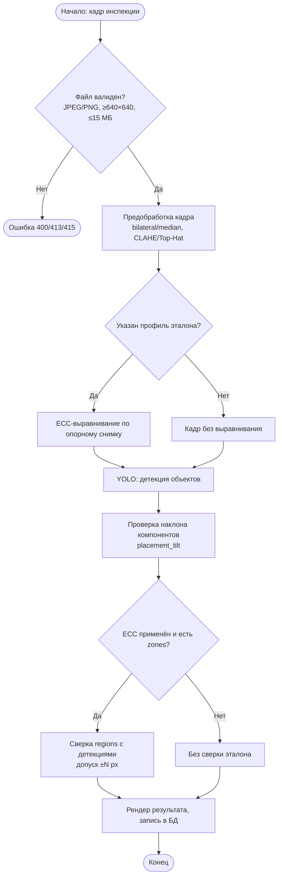
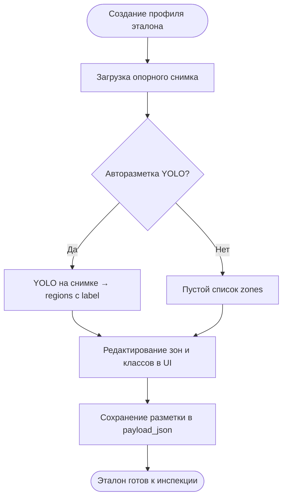
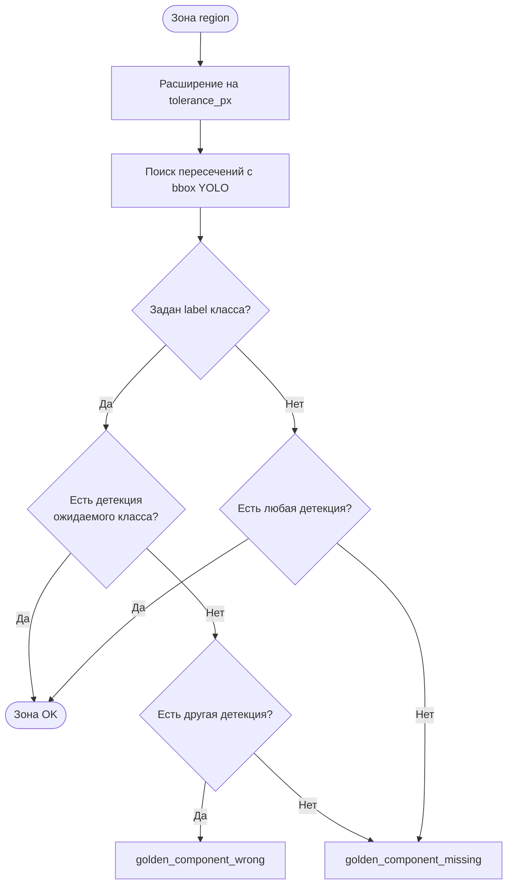

# ТЗ (фрагмент) — алгоритмы обнаружения дефектов AOI-Web

Документ для **генерации блок-схем** (ГОСТ 19.701-90) и поясняющего текста к разделу 4 пояснительной записки.  
Описано **только то, что реализовано в коде** на дату обновления; пункты «не реализовано» в схемы основного пайплайна **не включать**.

Модули: `app/api/inspections.py`, `app/services/preprocessing.py`, `app/services/golden_alignment.py`, `app/services/detector.py`, `app/services/post_detection.py`, `app/services/golden_region_check.py`, `app/services/golden_auto_markup.py`, `app/api/golden_boards.py`.

---

## 4.1. Назначение

Алгоритм инспекции формирует список областей подозрения на дефект по одному RGB-кадру печатной платы. Источник кадра: загрузка файла (JPEG/PNG) или снимок с мобильного устройства через веб-интерфейс. Результат сохраняется в БД и может быть проверен оператором вручную.

---

## 4.2. Алгоритм инспекции (основной пайплайн)

### 4.2.1. Последовательность шагов

| № | Блок (для схемы) | Действие | Модуль / API |
|---|------------------|----------|--------------|
| 1 | **Начало** | Получение кадра и параметров (`golden_board_profile_id`, пороги conf/IoU, допуск зон) | `POST /api/inspections`, `POST /api/inspections/live` |
| 2 | **Проверка входа** | Размер файла ≤ 15 МБ; формат JPEG/PNG; минимум 640×640 px | `load_image`, `ImageValidationError` |
| 3 | **Предобработка** | Опционально: undistort → шум (bilateral/median, **без Gaussian**) → CLAHE (YCrCb) или Top-Hat (Lab) | `apply_detection_preprocess` |
| 4 | **Условие** | Указан `golden_board_profile_id`? | форма инспекции |
| 4a | **ECC-выравнивание** | Сравнение кадра с опорным снимком эталона; при улучшении MAE — применение аффинного преобразования | `align_rgb_with_golden_profile` |
| 4b | **Пропуск ECC** | Кадр без изменений; `golden_alignment_used = false` | — |
| 5 | **Детекция YOLO** | Локализация объектов (дефекты платы, компоненты, пайка — по классам модели) | `detector.predict` |
| 6 | **Проверка наклона** | Для классов с семантикой «component»: угол > порога → дефект `placement_tilt` | `apply_component_tilt_rules` |
| 7 | **Условие** | ECC применён **и** в эталоне есть `regions` **и** проверка включена? | `GOLDEN_REGION_CHECK_ENABLED` |
| 7a | **Сверка с эталоном** | По каждой зоне: отсутствие / неверный класс YOLO → синтетические дефекты | `apply_golden_region_checks` |
| 7b | **Пропуск сверки** | Список дефектов без изменений (ECC не было или зон нет) | — |
| 8 | **Визуализация** | Полный кадр с рамками и подписями | `render_result_image` |
| 9 | **Сохранение** | Запись инспекции, bbox, метрики (MAE, время инференса) | БД `Inspection`, `Defect` |
| 10 | **Конец** | Ответ API / отображение в UI | — |

### 4.2.2. Блок-схема (Mermaid → draw.io / PlantUML)

### 4.2.3. Текст под рисунком (шаблон для записки)

На рисунке приведена блок-схема алгоритма автоматической инспекции одного кадра в системе AOI-Web. После проверки формата и разрешения изображения выполняется опциональная предобработка с подавлением шума методами, сохраняющими границы (билатеральный или медианный фильтр), и локальным выравниванием освещённости. При указании профиля Golden Board кадр выравнивается к опорному снимку методом ECC (Enhanced Correlation Coefficient). Далее нейросетевая модель YOLO выполняет локализацию объектов. Для компонентных классов дополнительно оценивается угол установки; при превышении порога формируется дефект `placement_tilt`. Если выравнивание по эталону успешно, выполняется сверка размеченных зон эталона с детекциями YOLO с учётом допуска по положению. Результат сохраняется в базе данных и отображается оператору.

---

## 4.3. Алгоритм подготовки эталона Golden Board

### 4.3.1. Последовательность (только admin)

| № | Блок | Действие |
|---|------|----------|
| 1 | Создание профиля | `POST /api/golden-boards` — имя, модель платы |
| 2 | Загрузка снимка | `POST .../reference-image` — JPEG/PNG ≥640×640 |
| 3 | **Условие** | `auto_markup=true` (по умолчанию)? |
| 3a | Авторазметка YOLO | Детекции → `regions[]` с полями `x1,y1,x2,y2,label` (класс модели); дефекты поверхности платы отфильтровываются |
| 3b | Ручная разметка | Оператор рисует рамки в UI; класс из списка `/api/meta` |
| 4 | Корректировка | Смена класса у каждой зоны; «Переразметить YOLO» — `POST .../auto-markup?replace=true` |
| 5 | Сохранение | `PUT .../markup` — запись `regions` в `payload_json` |

### 4.3.2. Блок-схема подготовки эталона

---

## 4.4. Алгоритм сверки зон эталона с детекциями

**Вход:** список детекций YOLO, массив `regions` из эталона, флаг `alignment_applied`, размер кадра, параметры `min_iou`, `tolerance_px`.

**Предусловие:** сверка выполняется **только если** ECC-выравнивание применено (`golden_alignment_used = true`). Иначе координаты зон не совпадают с кадром — проверка пропускается.

Для каждой зоны `region`:

1. Расширить прямоугольник на `tolerance_px` пикселей (по умолчанию 12; переопределение в форме инспекции 0–128).
2. Найти детекции с IoU ≥ `min_iou` (0.2) или с центром bbox внутри расширенной зоны.
3. Если в зоне задан **ожидаемый класс** (`label`):
   - есть детекция **того же** класса → зона OK;
   - есть детекция **другого** класса → дефект **`golden_component_wrong`**;
   - нет детекций → дефект **`golden_component_missing`**.
4. Если `label` пуст («любой объект»):
   - есть любая нетrivial детекция → зона OK;
   - иначе → **`golden_component_missing`**.

### 4.4.1. Блок-схема сверки одной зоны

---

## 4.5. Классы дефектов, формируемые алгоритмом (не моделью)

| Код | Условие формирования |
|-----|----------------------|
| `placement_tilt` | YOLO нашёл компонент; угол оси > `component_tilt_max_deg` (25°) |
| `golden_component_missing` | В зоне эталона нет подходящей детекции |
| `golden_component_wrong` | В зоне эталона детекция другого класса, чем `label` |

Остальные коды (`open`, `short`, `smd_resistor`, …) приходят **непосредственно из YOLO** (или fallback-детектора OpenCV в demo-режиме).

---

## 4.6. Параметры конфигурации (.env)

| Переменная | Назначение | По умолчанию |
|------------|------------|--------------|
| `DETECTION_PREPROCESS_ENABLED` | Включить предобработку перед YOLO | false |
| `PREPROCESS_NOISE_FILTER` | `none` / `bilateral` / `median` | none |
| `PREPROCESS_ILLUMINATION` | `none` / `clahe` / `tophat_lab` | none |
| `GOLDEN_REGION_CHECK_ENABLED` | Сверка zones после ECC | true |
| `GOLDEN_REGION_MIN_IOU` | Порог IoU для попадания в зону | 0.2 |
| `GOLDEN_REGION_TOLERANCE_PX` | Допуск смещения bbox, px | 12 |
| `component_tilt_max_deg` | Порог наклона компонента, ° | 25.0 |

Пороги YOLO (`detection_conf_threshold`, `detection_iou_threshold`) — в динамических настройках БД / форме инспекции.

---

## 4.7. Ручная проверка оператором (после автоматики)

Не входит в блок-схему **детекции**, но входит в **протокол инспекции**:

1. Оператор подтверждает или отклоняет каждый bbox (`PUT .../review`).
2. Пересчитывается `defects_count` по подтверждённым дефектам.
3. Экспорт архива дообучения: `masked.png` (маска на чёрном), кропы, YOLO-лейблы.

---

## 4.8. Не реализовано — не изображать как выполненное

- Многостадийный каскад с переключением пресетов WS2811 и захватом серии кадров в одной сессии.
- Реальный UART/TCP к МК (есть mock `hardware_gateway`).
- SIFT-fallback выравнивания, ROI-маска ECC.
- Пиксельное сравнение с шаблоном эталона.
- OCR маркировки, отдельный классификатор корпуса.
- Сверка `regions` при неуспешном ECC.

---

## 4.9. Связь с другими фрагментами ТЗ

- Предобработка кадра (п. 3.x): `docs/TZ_section3_preprocessing.md`
- Дорожная карта модернизации: `docs/TZ_IMPLEMENTATION_ROADMAP.md`
